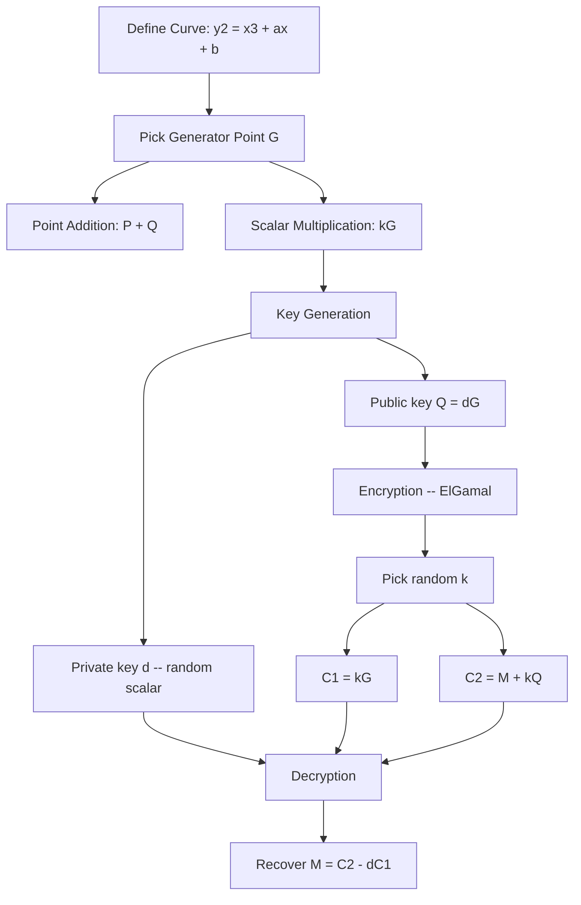

# ECC Visualizer

An interactive single-page app that walks through the entire Elliptic Curve Cryptography pipeline -- from raw curve math to ElGamal encryption and decryption -- with step-by-step animations on every operation.

Built with Next.js 16, React 19, Tailwind CSS v4, shadcn/ui, Framer Motion, and Zustand.

## How It Works

All math runs over real numbers (not finite fields) so the geometry is immediately visible. You can click the curve to place points, drag sliders to change parameters, and watch each algorithm play out one step at a time.



### Point Addition

Given two points P and Q on the curve, draw a line through them. It intersects the curve at a third point R'. Reflect R' across the x-axis to get P + Q.

For point doubling (P = Q), the line is the tangent at P.

### Scalar Multiplication

Compute kG using the double-and-add algorithm. The binary representation of k determines whether each step is a doubling or a doubling followed by an addition. The key generation tile visualizes every tangent line, secant line, and reflection as it builds up to the public key.

### ElGamal Encryption

1. **Key generation** -- pick a private scalar d, compute public key Q = dG.
2. **Encrypt** -- choose random k, output C1 = kG and C2 = M + kQ.
3. **Decrypt** -- compute shared secret dC1, recover M = C2 - dC1.

Security rests on the fact that recovering d from Q and G (the elliptic curve discrete logarithm problem) is computationally infeasible on a properly chosen curve.

## Bento Grid Layout

The page is organized as a bento grid with 8 tiles:

| Tile | What it does |
|---|---|
| **Elliptic Curve** | Interactive SVG plot. Click to place points P and Q. |
| **Curve Parameters** | Sliders for a and b with discriminant check. |
| **Message** | Text input mapped to a point on the curve. |
| **Point Addition** | Animated geometric construction of P + Q. |
| **Scalar Multiplication** | Double-and-add with binary expansion trace. |
| **Key Generation** | Full geometric visualization of dG with tangent/secant lines and SSH-style key output. |
| **Encryption** | ElGamal encrypt showing C1, C2 on the curve. |
| **Decryption** | Reverse operation recovering the original message point. |

## Getting Started

```bash
pnpm install
pnpm dev
```

Open [http://localhost:3000](http://localhost:3000).

## Tech Stack

- **Next.js 16** (App Router) + **React 19**
- **Tailwind CSS v4** + **shadcn/ui** (nova style, Geist font)
- **Framer Motion** for step-through animations
- **Zustand** for shared state across tiles
- Custom SVG rendering -- no charting libraries
